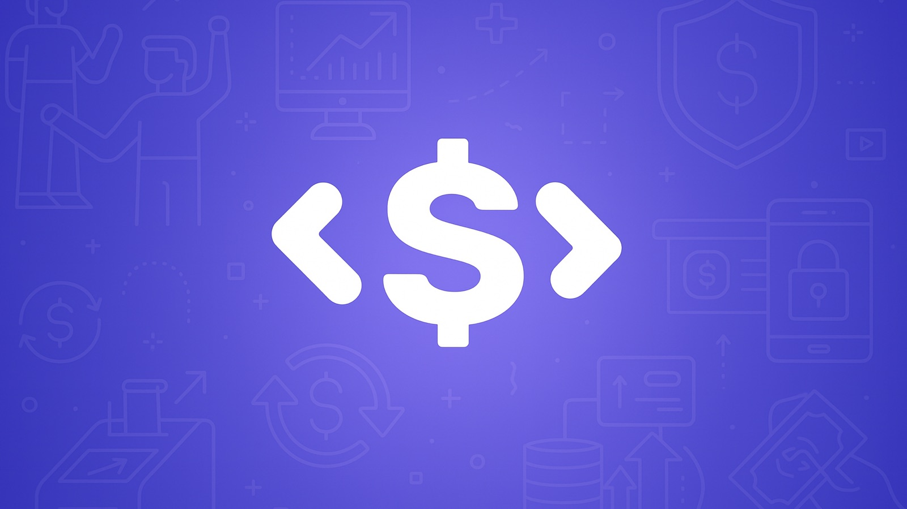
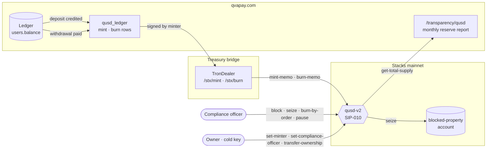

<div align="center">



# QUSD · QvaPay USD

**The SIP-010 token QvaPay, Inc. uses on Stacks to mirror the customer USD balances it holds in custody. 1 QUSD = 1 USD, redeemable at par.**

[](https://github.com/qvapay/QUSD/actions/workflows/test.yml)
[](https://docs.stacks.co/clarity)
[](https://docs.stacks.co/concepts/stacks-101/epochs)
[](https://github.com/stacksgov/sips/blob/main/sips/sip-010/sip-010-fungible-token-standard.md)
[(6)%20ready-2ea043)](https://www.qvapay.com/transparency/genius)
[](tests)
[](#license)

[**Explorer**](https://explorer.hiro.so/token/SP14CTSJZNKZ7YTR6C84368J2QXRW8RC20GSQ8KS2.QUSD) ·
[**Reserve disclosure**](https://www.qvapay.com/transparency/qusd) ·
[**GENIUS Act compliance**](https://www.qvapay.com/transparency/genius) ·
[**Compliance program**](https://www.qvapay.com/transparency) ·
[**Token metadata**](https://qvapay.com/qusd.json)

</div>

---

> QUSD is not legal tender, not a deposit, not FDIC-insured and not issued or backed by the U.S. government. Holding QUSD earns no interest or yield.

## Contents

- [At a glance](#at-a-glance)
- [How QUSD fits QvaPay](#how-qusd-fits-qvapay)
- [Why a v2](#why-a-v2)
- [Contract interface](#contract-interface)
- [Events](#events)
- [Errors](#errors)
- [Security model](#security-model)
- [Quick start](#quick-start)
- [Deployment](#deployment)
- [Repository layout](#repository-layout)
- [Documentation](#documentation)

## At a glance

| | |
|---|---|
| Name · symbol · decimals | `QvaPayUSD` · `QUSD` · 8 |
| Standard | [SIP-010](https://github.com/stacksgov/sips/blob/main/sips/sip-010/sip-010-fungible-token-standard.md) (`SP3FBR2AGK5H9QBDH3EEN6DF8EK8JY7RX8QJ5SVTE.sip-010-trait-ft-standard`) + SIP-016 metadata |
| Issuer | QvaPay, Inc. — FinCEN-registered MSB, BSA ID 31000329382692 |
| Peg · redemption | 1 QUSD = 1 USD, at par, through any enabled withdrawal rail |
| v1 (live) | [`SP14CTSJZNKZ7YTR6C84368J2QXRW8RC20GSQ8KS2.QUSD`](https://explorer.hiro.so/token/SP14CTSJZNKZ7YTR6C84368J2QXRW8RC20GSQ8KS2.QUSD) — minimal SIP-010, frozen |
| v2 | `SP14CTSJZNKZ7YTR6C84368J2QXRW8RC20GSQ8KS2.qusd-v2` — GENIUS controls, **pending deployment** ([runbook](docs/deploy-v2.md)) |
| Deployer | mainnet `SP14CTSJZNKZ7YTR6C84368J2QXRW8RC20GSQ8KS2` · testnet `ST14CTSJZNKZ7YTR6C84368J2QXRW8RC20K8V67HB` |
| Outstanding QUSD | published monthly at [qvapay.com/transparency/qusd](https://www.qvapay.com/transparency/qusd), read from `get-total-supply` |

## How QUSD fits QvaPay

Every credited deposit on qvapay.com **mints** QUSD and every completed withdrawal **burns** it, so that on-chain supply tracks the sum of customer balances. The treasury bridge (TronDealer) is the only caller of `mint` / `burn`; customers hold QUSD on the QvaPay ledger today, and on-chain withdrawal to a self-custody wallet is the next product step.



## Why a v2

Clarity contracts are immutable. The v1 contract is a textbook SIP-010: open transfers, owner-only mint/burn, one key for everything and no way to rotate it. The [GENIUS Act](https://www.congress.gov/119/plaws/publ27/PLAW-119publ27.htm) (Pub. L. 119-27, § 4(a)(6)) requires a payment stablecoin issuer to have the **technological capability to seize, freeze, burn or prevent the transfer** of its stablecoin under a lawful order. `qusd-v2` adds exactly that and nothing else, and keeps the v1 `mint` / `burn` signatures so the treasury bridge is untouched.

| Capability | `QUSD` (v1) | `qusd-v2` |
|---|:---:|:---:|
| SIP-010 `transfer` | open | refused while paused or when either party is blocked |
| Mint | owner | `minter` role, refused to blocked recipients |
| Burn | owner, from **any** holder | `minter`, only from its **own** balance |
| Freeze (blocklist) | — | `block-principal` / `unblock-principal` |
| Seize | — | `seize` → blocked-property account (31 CFR § 501.603) |
| Burn under lawful order | — | `burn-by-order` (blocked holders only) |
| Pause | — | `pause` / `unpause`; compliance actions keep working |
| Owner rotation | impossible | two-step `transfer-ownership` → `accept-ownership` |
| Separation of duties | one key | owner · minter · compliance-officer · blocked-property-account |
| Ledger reconciliation | — | `mint-memo` / `burn-memo` carry a 34-byte reference |
| Auditability | memo only | structured `print` event on every state change |

Obligation-by-obligation mapping: [docs/genius-compliance.md](docs/genius-compliance.md). Public status page: [qvapay.com/transparency/genius](https://www.qvapay.com/transparency/genius).

## Contract interface

### SIP-010

| Function | Notes |
|---|---|
| `transfer (amount uint) (sender principal) (recipient principal) (memo (optional (buff 34)))` | `tx-sender` must be `sender`; refused while paused or if either party is blocked |
| `get-name` · `get-symbol` · `get-decimals` · `get-balance (who)` · `get-total-supply` · `get-token-uri` | read-only |

### Issuance — `minter`

| Function | Notes |
|---|---|
| `mint (amount) (recipient)` | v1 signature. Refused while paused or to a blocked recipient |
| `mint-memo (amount) (recipient) (memo)` | same, with a ledger reference in the event |
| `burn (amount) (sender)` | v1 signature. `sender` **must be the minter itself** |
| `burn-memo (amount) (sender) (memo)` | same, with reference |

### Compliance — `compliance-officer` (the owner can always act too)

| Function | Notes |
|---|---|
| `block-principal (who) (reason (string-ascii 64))` | freeze in both directions; `reason` is an internal case id, never the order text |
| `unblock-principal (who)` | requires a prior block |
| `seize (who) (amount) (order-ref)` | blocked holder → blocked-property account; supply unchanged |
| `burn-by-order (who) (amount) (order-ref)` | blocked holder only; supply decreases |
| `pause` / `unpause` | stops transfers and minting; seize / burn-by-order keep working |

### Governance — `contract-owner`

| Function | Notes |
|---|---|
| `transfer-ownership (new-owner)` → `accept-ownership` | two-step; a typo never orphans the contract |
| `set-minter (who)` · `set-compliance-officer (who)` | role rotation |
| `set-blocked-property-account (who)` | the account can never be blocked |
| `set-token-uri` · `set-token-name` · `set-token-symbol` | each emits the SIP-016 `token-metadata-update` notification |

### Read-only

`get-owner` · `get-pending-owner` · `get-minter` · `get-compliance-officer` · `get-blocked-property-account` · `is-paused` · `is-blocked (who)` · `get-block-info (who)` → `(optional { since: uint, reason: (string-ascii 64) })`

## Events

Every state change prints a tuple so the ledger, the OFAC blocked-property report and the monthly reserve disclosure can be rebuilt from chain data alone.

| `event` | Payload |
|---|---|
| `mint` · `burn` | `amount`, `account`, `memo`, `by`, `height` |
| `block` | `account`, `reason`, `by`, `height` |
| `unblock` | `account`, `by`, `height` |
| `seize` | `account`, `amount`, `to`, `order-ref`, `by`, `height` |
| `burn-by-order` | `account`, `amount`, `order-ref`, `by`, `height` |
| `pause` · `unpause` | `by`, `height` |
| `ownership-proposed` · `ownership-accepted` · `set-minter` · `set-compliance-officer` · `set-blocked-property-account` | `account`, `by`, `height` |
| `token-metadata-update` | SIP-016 notification `{ contract-id, token-class: "ft" }` |

`transfer` prints the raw memo when one is supplied (SIP-010 convention).

## Errors

| Code | Constant | When |
|---|---|---|
| `u100` | `ERR-OWNER-ONLY` | governance call by a non-owner; wrong principal accepting ownership |
| `u101` | `ERR-NOT-TOKEN-OWNER` | `transfer` where `tx-sender ≠ sender`; minter burning someone else's balance |
| `u102` | `ERR-NOT-ENOUGH-FUND` | reserved (the FT primitives return `u1` on insufficient balance) |
| `u103` | `ERR-INVALID-PARAMETERS` | zero amount; blocking the blocked-property account |
| `u104` | `ERR-MINTER-ONLY` | mint / burn by a non-minter |
| `u105` | `ERR-PAUSED` | transfer or mint while paused |
| `u106` | `ERR-BLOCKED` | a party is on the blocklist |
| `u107` | `ERR-NOT-BLOCKED` | seize / burn-by-order / unblock on a principal that is not blocked |
| `u108` | `ERR-NO-PENDING-OWNER` | `accept-ownership` with no proposal |
| `u109` | `ERR-COMPLIANCE-ONLY` | compliance call by a principal that is neither officer nor owner |

FT primitive errors propagate unchanged: `u1` insufficient balance, `u2` sender = recipient, `u3` zero amount. Codes `u100`–`u103` are identical to v1.

## Security model

| Threat | Answer |
|---|---|
| Operational (hot) key lost or compromised | The minter can only burn its own balance and cannot touch the blocklist. The owner rotates it with `set-minter`. |
| Owner key lost | v1 had no recovery at all. v2 ownership transfer is two-step and the owner key is meant to stay cold. |
| Sanctioned address receives QUSD | `block-principal` freezes it both ways; `seize` moves the property to the blocked-property account without changing supply; the § 501.603(b) report is built from `seize` events. |
| Order to destroy tokens | `burn-by-order` on a blocked holder, with the order reference in the event. |
| Incident | `pause` halts transfers and issuance; lawful-order actions keep working. |
| Mint to a wrong address | `block-principal` + `seize` recovers it into the blocked-property account. |

The 18 v2 tests in [`tests/qusd-v2.test.ts`](tests/qusd-v2.test.ts) exercise every role boundary, both blocklist directions, seize / burn-by-order preconditions, pause semantics and the two-step ownership flow.

## Quick start

Requires Node.js ≥ 22. The test runner ships its own simnet; the `clarinet` CLI is only needed for `clarinet check`, the console and real deployments.

```bash
git clone https://github.com/qvapay/QUSD.git && cd QUSD
npm install
npm test               # 28 tests across the three contracts
npm run test:report    # + coverage and cost report
```

```bash
brew install clarinet  # optional
clarinet check         # static analysis
clarinet console       # REPL on simnet
```

```clarity
;; in clarinet console — deployer holds every role
(contract-call? .qusd-v2 mint u100000000 tx-sender)                         ;; 1 QUSD
(contract-call? .qusd-v2 block-principal 'ST1SJ3DTE5DN7X54YDH5D64R3BCB6A2AG2ZQ8YPD5 "CASE-1")
(contract-call? .qusd-v2 is-blocked 'ST1SJ3DTE5DN7X54YDH5D64R3BCB6A2AG2ZQ8YPD5)  ;; (ok true)
(contract-call? .qusd-v2 get-total-supply)                                 ;; (ok u100000000)
```

`npm test` regenerates `deployments/default.simnet-plan.yaml` from `Clarinet.toml`; commit that change when you add a contract.

## Deployment

Step-by-step runbook, from installing Clarinet to switching the treasury bridge: [docs/deploy-v2.md](docs/deploy-v2.md). In short:

1. `clarinet deployments apply -p deployments/default.mainnet-plan.yaml` publishes `qusd-v2` (the v1 batch is skipped as already deployed).
2. Roles, v1 retirement, initial mint and ownership rotation are signed with [`scripts/call.mjs`](scripts/call.mjs):

```bash
STX_PRIVATE_KEY=<hex> node scripts/call.mjs set-compliance-officer SP…CCO
STX_PRIVATE_KEY=<hex> node scripts/call.mjs burn u95150855000000 SP14CTSJZNKZ7YTR6C84368J2QXRW8RC20GSQ8KS2 --v1
STX_PRIVATE_KEY=<hex> node scripts/call.mjs mint-memo u79303371000000 SP…HOT 0x6375743a…
```

`settings/Mainnet.toml` / `settings/Testnet.toml` hold the deployer mnemonic and are git-ignored. Add `--dry` to build a transaction without broadcasting it.

## Repository layout

```
contracts/
  QUSD.clar              v1 — deployed on mainnet, frozen
  qusd-v2.clar           v2 — GENIUS controls (this README)
  qusd-notifier.clar     SIP-016 metadata refresh helper (not deployed)
tests/                   vitest + @hirosystems/clarinet-sdk — 28 tests
deployments/             Clarinet plans: simnet · devnet · testnet · mainnet
scripts/call.mjs         sign & broadcast contract calls from the CLI
docs/
  genius-compliance.md   GENIUS Act obligations ↔ contract mechanisms
  deploy-v2.md           mainnet deployment, step by step
  migration-v1-to-v2.md  retire v1 to zero, initial mint, ledger go-live
assets/                  brand kit — cover, logo in 4 sizes, Pixelmator source (see Brand assets)
qusd.json                token metadata served at https://qvapay.com/qusd.json
```

## Brand assets

| File | Size | Use |
|---|---|---|
| [`assets/cover.jpg`](assets/cover.jpg) | 1600 × 900 | README banner, social preview |
| [`assets/cover-4096.png`](assets/cover-4096.png) | 4096 × 2304 | print, press, full-resolution source |
| [`assets/QUSD.png`](assets/QUSD.png) | 1000 × 1000, square | canonical token image (`qusd.json` → `https://qvapay.com/qusd.png`) |
| [`assets/logo-512-rounded.png`](assets/logo-512-rounded.png) | 512 × 512, rounded square | app icon, token lists |
| [`assets/logo-512-circle.png`](assets/logo-512-circle.png) | 512 × 512, circle | explorers and wallets (coin format) |
| [`assets/logo-100-circle.png`](assets/logo-100-circle.png) | 100 × 100, circle | emoji, chat avatars |
| [`assets/QUSD.pxd`](assets/QUSD.pxd) | — | Pixelmator Pro source |
| [`assets/QUSD.svg`](assets/QUSD.svg) | 1000 × 1000 | raster wrapped in SVG, **not a real vector** — a traced SVG is still pending |

Colour: `#6759EF` background, white symbol. QUSD is a QvaPay, Inc. trademark; use the assets to reference the token, never to imply endorsement.

## Documentation

| | |
|---|---|
| [GENIUS Act compliance](https://www.qvapay.com/transparency/genius) | the 22 obligations of Pub. L. 119-27, status of each |
| [Monthly reserve disclosure](https://www.qvapay.com/transparency/qusd) | outstanding QUSD, reserve composition, redemption policy |
| [Compliance program](https://www.qvapay.com/transparency) | BSA/AML, OFAC screening, Travel Rule, SAR |
| [Permitted fund flows](https://www.qvapay.com/fund-flows) | how QUSD is created, moved and burned |
| [SIP-010](https://github.com/stacksgov/sips/blob/main/sips/sip-010/sip-010-fungible-token-standard.md) · [SIP-016](https://github.com/stacksgov/sips/blob/main/sips/sip-016/sip-016-token-metadata.md) | the standards this token implements |
| [Clarinet](https://docs.hiro.so/stacks/clarinet) · [Clarity](https://docs.stacks.co/clarity) | tooling and language |

## License

ISC © QvaPay, Inc.

<div align="center">
<sub>Built by <a href="https://qvapay.com">QvaPay</a> on <a href="https://stacks.co">Stacks</a>, secured by Bitcoin.</sub>
</div>
